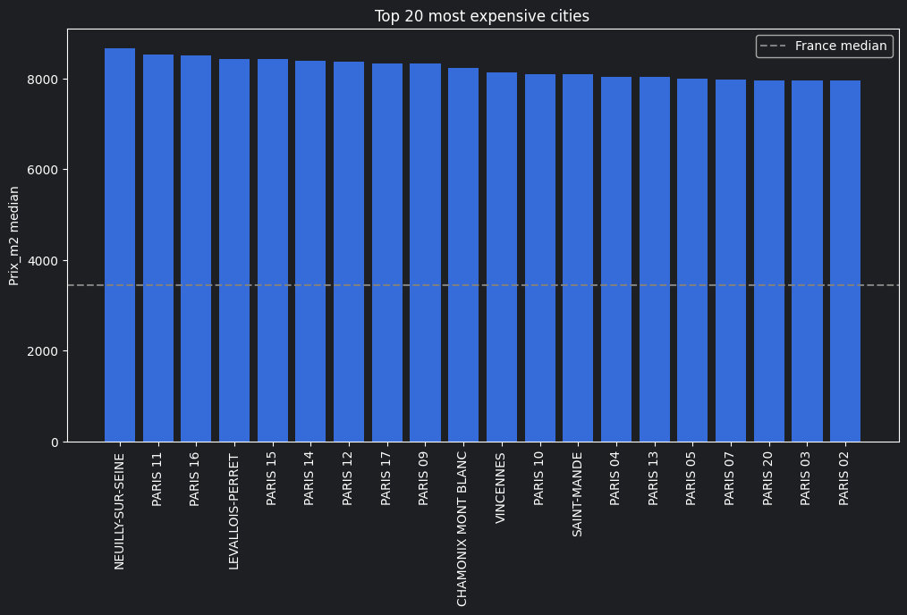

# Immo_Analyse 🏠

Exploratory analysis of the French real estate market using official DVF
(Demandes de Valeurs Foncières) 2025 data — 465,000+ transactions across France.

---

## Key Findings

- **Median price/m²** : 3,443 € nationally (core market)
- **Most expensive city** : Neuilly-sur-Seine at 8,667 €/m²
- **Most expensive department** : Paris (75) at 8,158 €/m²
- **Top city by volume** : Nice with 7,818 transactions
- **Primary price driver** : built area (Spearman r=0.63), ahead of location
- **Seasonality** : volume varies up to 80% across months — prices remain stable (~10%)

---

## Project Structure
```bash
Immo_Analyse/  
├── notebooks/  
│   ├── 01_exploration.ipynb    # Initial data exploration  
│   ├── 02_cleaning.ipynb       # Cleaning pipeline  
│   └── 03_analysis.ipynb       # Full market analysis  
├── src/  
│   ├── data/                   # Loading, cleaning, enrichment  
│   ├── analysis/               # Metrics and aggregations  
│   ├── features/               # Feature engineering  
│   └── utils/                  # Helpers  
├── api/  
│   └── app.py                  # REST API (FastAPI)  
├── reports/  
│   ├── summary.md              # Analysis results  
│   └── figures/                # Exported charts  
├── config/config.yaml  
└── requirements.txt  
```

---

## Stack


**Data wrangling** : Pandas, NumPy  
**Visualisation** : Matplotlib  
**Storage** : Parquet (Snappy compression)  
**API** : FastAPI  
**Environment** : Python 3.11, virtual env  

---

## Getting Started

### 1 — Clone & install

```bash
git clone https://github.com/DFlorette/real-estate-analysis.git
cd Immo
python -m venv venv
source venv/bin/activate        # Windows: venv\Scripts\activate
pip install -r requirements.txt
```

### 2 — Download the data

Download `ValeursFoncieres-2025.txt` from
[data.gouv.fr](https://www.data.gouv.fr/fr/datasets/demandes-de-valeurs-foncieres/)
and place it in `data/raw/`.

See [`data/README.md`](data/README.md) for details.

### 3 — Run the pipeline

```bash
python run_pipeline.py
```

### 4 — Explore the notebooks

```bash
jupyter notebook notebooks/
```

---

## Dataset

| Property | Value |
|---|---|
| Source | data.gouv.fr — DVF 2025 |
| Raw transactions | 465,206 |
| Core market (p10–p90) | 372,196 |
| Variables | 18 |
| Memory | ~68 MB |
| License | Licence Ouverte / Open Licence v2.0 (Etalab) |

Raw data files are not versioned — see [`data/README.md`](data/README.md).

---

## Results

Full findings in [`reports/summary.md`](reports/summary.md).



---

## Author

**DFlorette** — Data Analyst  
[GitHub](https://github.com/DFlorette)