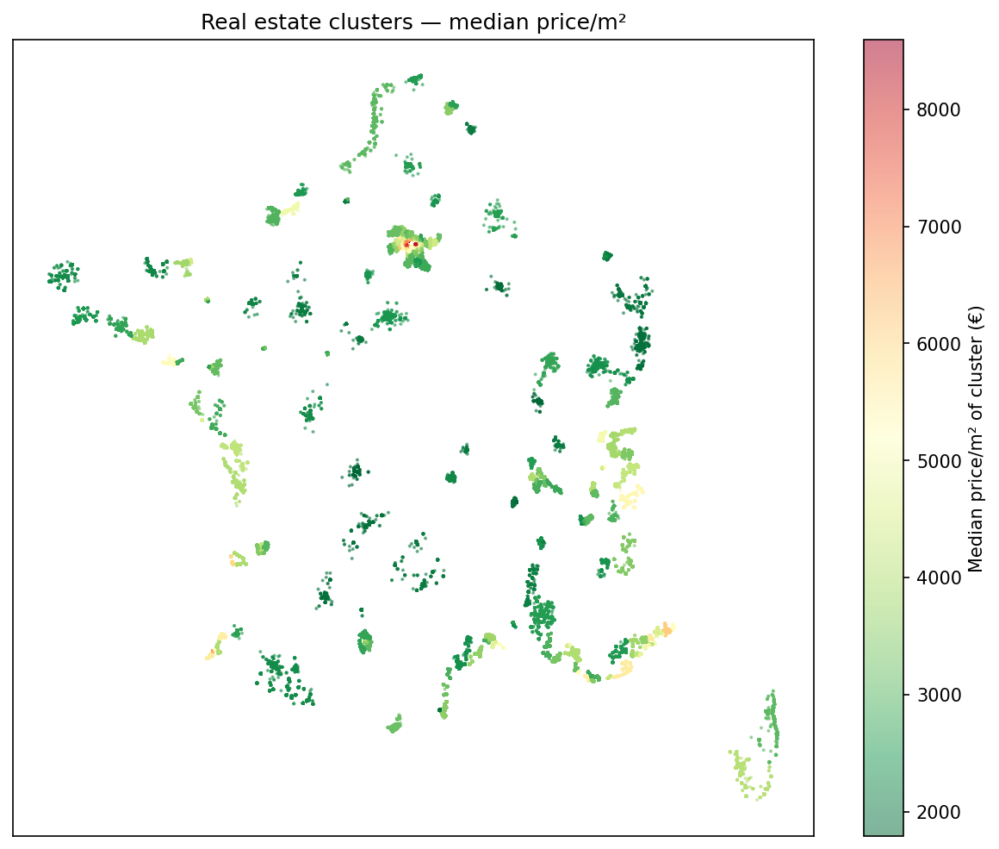
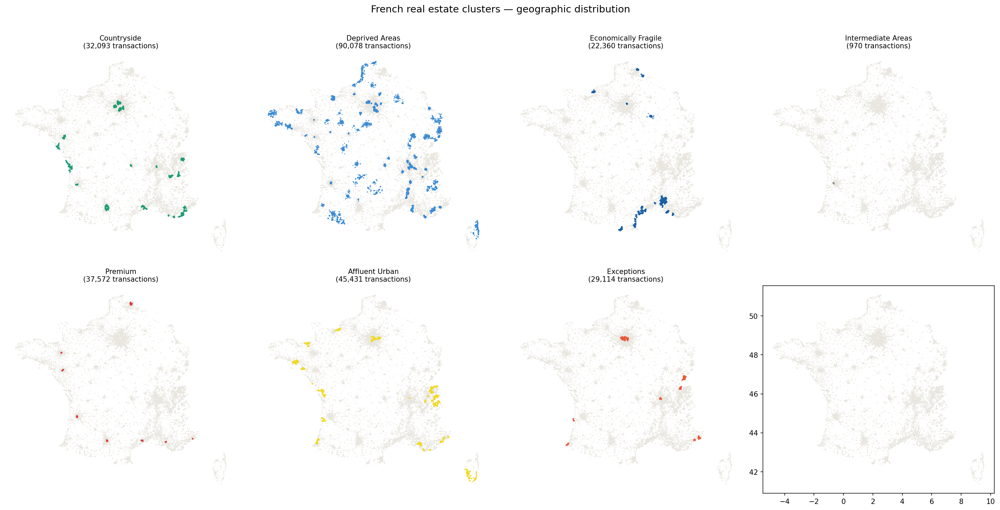
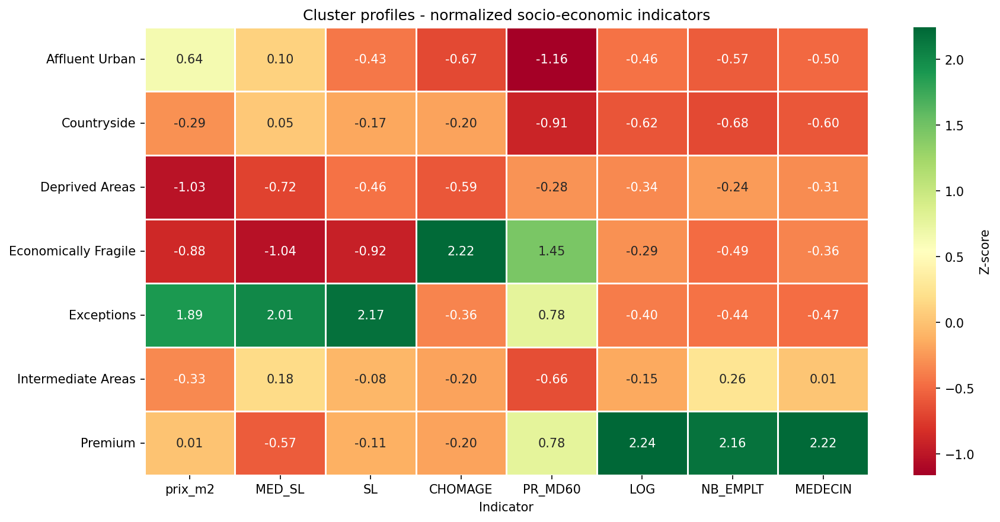
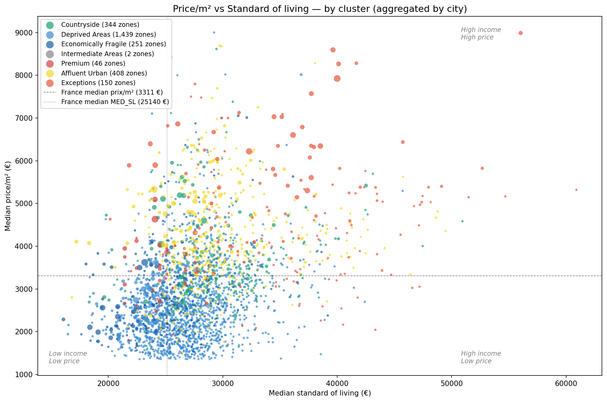

# French Real Estate Analysis 🏠

Exploratory analysis of the French real estate market using official DVF
(Demandes de Valeurs Foncières) 2025 data — 465,000+ transactions enriched
with INSEE socio-economic indicators at commune, intercommunal, and
employment zone levels.

---

## Key Findings

- **Median price/m²** : €3,443 nationally (core market)  
- **Most expensive city** : Neuilly-sur-Seine at €8,667/m²  
- **Primary price drivers** : local income (SL + MED_SL = 42% RF importance) and geography (lat/lon = 20%)  
- **237 real estate clusters** identified via HDBSCAN — from Deprived Areas to Exceptions  
- **Income decoupling** : tourist cities (Ajaccio, Fréjus) and periurban zones (Cergy, Pierrelaye) show high prices despite modest local income  
- **Seasonality** : volume varies up to 80% across months — prices remain stable (~10%)  

---

## Key Visualizations

| | |
|---|---|
|  |  |
|  |  |

---

## Project Structure

```bash
real-estate-analysis/
├── notebooks/
│   ├── 01_exploration.ipynb        # Initial data exploration
│   ├── 02_cleaning.ipynb           # Cleaning pipeline
│   ├── 03_analysis.ipynb           # Full market analysis
│   ├── 04_features_analysis.ipynb  # RF feature importance + correlations
│   └── 05_clustering.ipynb         # HDBSCAN clustering + profiling
├── src/
│   ├── data/                       # Loading, cleaning, geocoding, enrichment
│   ├── analysis/                   # Metrics and aggregations
│   ├── features/                   # Feature engineering
│   └── utils/                      # Helpers
├── api/
│   └── app.py                      # REST API (FastAPI)
├── reports/
│   ├── summary.md                  # Full analysis results
│   └── figures/                    # Exported charts
├── data/
│   └── README.md                   # Data sources and download instructions
├── run_pipeline.py                 # End-to-end pipeline
├── config/config.yaml
└── requirements.txt
```

---

## Stack


**Data wrangling** : Pandas, NumPy  
**Visualisation** : Matplotlib, Seaborn  
**Machine learning** : Scikit-learn (RandomForest), HDBSCAN  
**Geocoding** : API Géo (data.gouv.fr) + JSON cache  
**Storage** : Parquet (Snappy compression)  
**API** : FastAPI  
**Environment** : Python 3.11, virtual env  

---

## Dataset

| Property              | Value                                        |
|-----------------------|----------------------------------------------|
| Source                | data.gouv.fr — DVF 2025                      |
| Raw transactions      | 465,206                                      |
| Core market (p10–p90) | 372,196                                      |
| Enriched dataset      | 379,890 — 38 variables                       |
| Raw DVF variables     | 18                                           |
| Memory                | ~68 MB                                       |
| License               | Licence Ouverte / Open Licence v2.0 (Etalab) |

**External sources (INSEE) :**
- Stats_Communes 2022–2023 — income, employment, infrastructure
- Stats_Intercommunes 2023 — salary, poverty rate
- Taux_Chômage 2025 Q4 — unemployment by employment zone
- Appartenance_Commune — geographic hierarchy

Raw data files are not versioned — see [`data/README.md`](data/README.md).

---

## Getting Started

### 1 — Clone & install

```bash
git clone https://github.com/DFlorette/real-estate-analysis.git
cd real-estate-analysis
python -m venv venv
source venv/bin/activate        # Windows: venv\Scripts\activate
pip install -r requirements.txt
```

### 2 — Download the data

Download `ValeursFoncieres-2025.txt` from
[data.gouv.fr](https://www.data.gouv.fr/fr/datasets/demandes-de-valeurs-foncieres/)
and the INSEE files listed in [`data/README.md`](data/README.md).
Place all files in `data/raw/`.

### 3 — Run the pipeline

```bash
python run_pipeline.py
```

> First run includes geocoding (~500k addresses via API) — this may take
> several hours. Subsequent runs use the JSON cache automatically.

### 4 — Explore the notebooks

```bash
jupyter notebook notebooks/
```

---

## Results

Full findings in [`reports/summary.md`](reports/summary.md).

---

## Next Steps

- [ ] Interactive dashboard via the API (`api/app.py`)

---

## Author

**DFlorette** — Data Analyst
[GitHub](https://github.com/DFlorette)